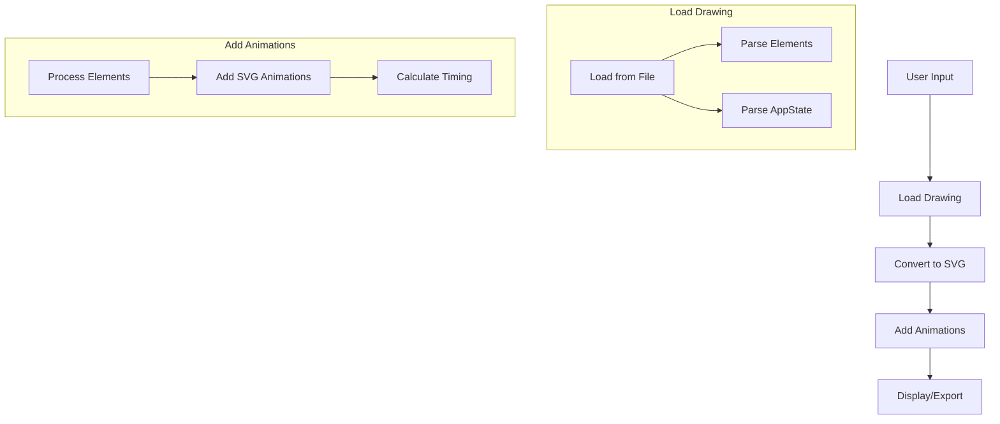

# How Excalidraw Animate Works

## Core Flow



## Key Components

1. **Entry Points** (Toolbar.tsx)
   - Load File button
   - Load Library button 
   - URL/link input

2. **Loading Process** (useLoadSvg.ts)
   - Uses Excalidraw's `loadFromBlob` or `loadScene` to parse files
   - Converts elements into Excalidraw's internal format
   - Handles both single drawings and libraries

3. **SVG Generation** (useLoadSvg.ts)
   - Uses Excalidraw's `exportToSvg` to convert elements to SVG
   - Preserves all styling and properties
   - Handles special cases like fonts

4. **Animation Engine** (animate.ts)
   - Core algorithm that adds SVG animations
   - Key functions:
     - `animateSvg`: Main entry point
     - `patchSvgEle`: Processes each element type
     - Element-specific handlers (patchSvgLine, patchSvgArrow, etc.)

## Animation Strategy

1. **Element Processing**
   - Each Excalidraw element is processed based on its type
   - Elements are animated in sequence based on:
     - Group membership
     - Order in the drawing
     - Custom timing attributes

2. **Animation Types**
   - Lines/Arrows: Animated path drawing
   - Shapes: Path morphing
   - Text: Character appearance
   - Free drawing: Point-by-point animation
   - Images: Fade in

3. **Timing Control**
   - Default durations per element type
   - Group synchronization
   - Custom duration support via element IDs
   - Pause/resume/step controls

## Technical Details

### SVG Animation Techniques

1. **Path Animation**
   ```xml
   <animate 
     attributeName="d"
     from="initial path"
     to="final path"
     dur="duration"
     fill="freeze"
   />
   ```

2. **Opacity Animation**
   ```xml
   <animate
     attributeName="opacity"
     from="0"
     to="1"
     dur="duration"
     fill="freeze"
   />
   ```

### Key Algorithms

1. **Path Drawing Animation**
   - Break down complex paths into segments
   - Animate each segment sequentially
   - Handle special cases like curves and arrowheads

2. **Group Timing**
   - Calculate total duration based on group size
   - Distribute timing among group members
   - Maintain synchronization between related elements

3. **Text Animation**
   - Create text paths for character animation
   - Handle different font families
   - Support text alignment and styling

## Export Options

1. **SVG Export**
   - Preserves all animations
   - Can be played in any SVG-capable viewer

2. **WebM Export**
   - Records screen capture of animation
   - Handles timing and synchronization
   - Produces video file for sharing

